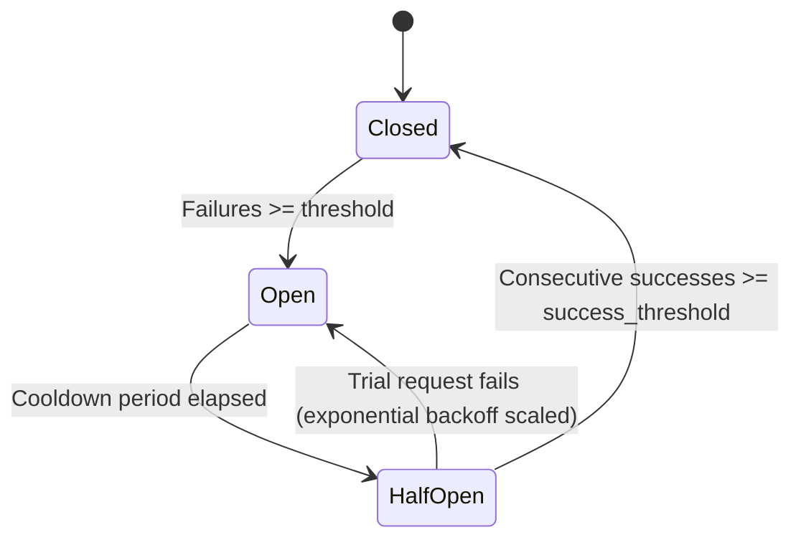

# External Service Circuit Breaker (Issue #944)

## Overview
The External Service Circuit Breaker protects the ArenaX backend from cascading failures caused by outages, network timeouts, or degraded performance in third-party services (e.g. Stellar Horizon, Soroban RPC, external payment providers, webhooks).

## States & State Transitions



1. **Closed**: Normal state. All requests are allowed through. Consecutive failures are tracked. When failures reach `failure_threshold` (default: 5), the circuit trips to `Open`.
2. **Open**: Outage state. Incoming calls fail fast immediately with `503 Service Unavailable` and a `Retry-After` header without making any network calls to the external service.
3. **HalfOpen**: Recovery state. Once the exponential backoff cooldown has elapsed, the circuit admits a limited number of trial probe requests (`half_open_probe_limit`, default: 1).
   - If the trial request succeeds and reaches `success_threshold` (default: 2), the circuit transitions back to `Closed` and resets the backoff exponent.
   - If the trial request fails, the circuit immediately returns to `Open` and scales the cooldown duration exponentially.

## Exponential Backoff Calculation

The cooldown period before transitioning from `Open` to `HalfOpen` grows exponentially with consecutive trip cycles:

$$\text{cooldown} = \min\left(\text{max\_backoff}, \; \text{initial\_backoff} \times \text{backoff\_multiplier}^{(\text{trip\_count} - 1)}\right)$$

### Default Settings
- `failure_threshold`: 5 consecutive failures
- `success_threshold`: 2 consecutive successes
- `initial_backoff`: 5 seconds
- `max_backoff`: 60 seconds
- `backoff_multiplier`: 2.0
- `half_open_probe_limit`: 1 concurrent probe
- `request_timeout`: 10 seconds

## Usage

### 1. Service Registry Wrapper
```rust
use arenax_backend::middleware::circuit_breaker::CircuitBreakerRegistry;

let registry = CircuitBreakerRegistry::default();

// Execute outbound calls under the "stellar" circuit breaker
let result = registry.call("stellar", || async {
    // Outbound HTTP request to Stellar Horizon
    reqwest::get("https://horizon.stellar.org/accounts/XYZ").await
}).await;

match result {
    Ok(data) => println!("Success: {:?}", data),
    Err(CircuitBreakerError::CircuitOpen { service, retry_after_secs }) => {
        eprintln!("Fast failed: {} circuit is open, retry in {}s", service, retry_after_secs);
    }
    Err(CircuitBreakerError::Timeout(dur)) => {
        eprintln!("Call timed out after {:?}", dur);
    }
    Err(CircuitBreakerError::Inner(e)) => {
        eprintln!("External call failed: {:?}", e);
    }
}
```

### 2. Actix-Web Route Middleware
```rust
use actix_web::{web, App};
use arenax_backend::middleware::circuit_breaker::{
    CircuitBreaker, CircuitBreakerConfig, ExternalCircuitBreakerMiddleware,
};

let breaker = Arc::new(CircuitBreaker::new(
    CircuitBreakerConfig::new("proxy_service")
        .with_failure_threshold(3)
        .with_initial_backoff(Duration::from_secs(10)),
));

App::new()
    .service(
        web::scope("/api/external")
            .wrap(ExternalCircuitBreakerMiddleware::new(breaker.clone()))
            .route("/proxy", web::get().to(proxy_handler))
    );
```

## Metrics Export
The circuit breaker publishes Prometheus metrics via the `/metrics` endpoint:

| Metric Name | Type | Labels | Description |
|-------------|------|--------|-------------|
| `circuit_breaker_state` | Gauge | `service` | Current state (0 = Closed, 1 = HalfOpen, 2 = Open) |
| `circuit_breaker_requests_total` | Counter | `service`, `status` | Total requests (`success`, `failure`, `rejected`) |
| `circuit_breaker_trips_total` | Counter | `service` | Total times circuit tripped Open |
