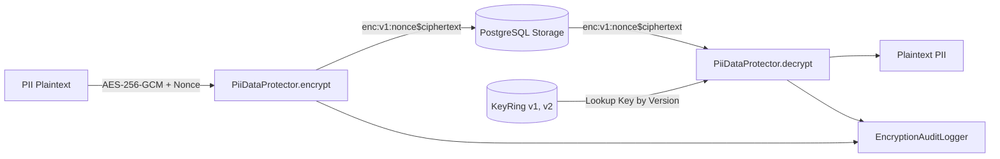

# Data Encryption at Rest & Key Rotation (Issue #951)

## Overview
ArenaX backend implements authenticated data encryption at rest for Personally Identifiable Information (PII) and sensitive records (phone numbers, emails, device fingerprints, secrets) using **AES-256-GCM** (NIST SP 800-38D).

## Key Features

1. **Authenticated Encryption (AEAD)**:
   - Uses AES-256-GCM providing both confidentiality and integrity/tamper detection.
   - Generates a unique, cryptographically random 96-bit nonce per encryption operation via `OsRng`.
2. **Versioned Envelope Format**:
   - `enc:v<version>:<nonce_hex>$<ciphertext_and_tag_hex>`
   - Allows multi-version key rings to coexist without breaking older stored data.
3. **Live Key Rotation**:
   - `KeyRing` supports multiple key versions (`v1`, `v2`, `v3`).
   - New encryptions always use the `active_version`.
   - Older ciphertext is transparently decrypted using the corresponding historical key in the key ring.
   - `reencrypt()` allows zero-downtime lazy or background batch migrations to the latest active key.
4. **Transparent Decryption & PII Redaction**:
   - `EncryptedField<T>` wrapper implements `Serialize` and `Deserialize` with Serde.
   - `Debug` and `Display` implementations automatically redact plaintext (`"[REDACTED_PII]"`) to prevent accidental log leakage.
   - Explicit `.expose_secret()` or `.decrypt()` method ensures deliberate access.
5. **Access Audit Trail**:
   - Every encryption, decryption, failed authentication, key rotation, and re-encryption emits a structured security audit event.
   - Captures timestamp, operation (`ENCRYPT`, `DECRYPT`, `KEY_ROTATION`, `REENCRYPT`, `DECRYPT_FAILED`), target field name, key version, actor ID, and operation duration in microseconds.
6. **High Performance (<5% Overhead)**:
   - Microsecond-level AES-256-GCM execution (sub-10 µs per field).
   - Minimal allocations and hardware AES-NI acceleration where available.

## Architecture



## Key Rotation Workflow

1. Generate a new 256-bit encryption key.
2. Register and promote the new key in the `KeyRing`:
   ```rust
   let new_key = EncryptionKey::generate();
   key_ring.rotate_key("v2", new_key);
   ```
3. All new records will immediately be written under `v2`.
4. Existing records stored under `v1` continue to be read transparently.
5. (Optional) Run background re-encryption worker:
   ```rust
   let updated_envelope = protector.reencrypt(&old_envelope, "user.email", Some("migration_worker"))?;
   ```

## Configuration & Environment Variables

| Variable | Description |
|----------|-------------|
| `ENCRYPTION_KEY_V1` | 64-character hexadecimal representation of 256-bit key for version 1 |
| `ENCRYPTION_KEY_V2` | 64-character hexadecimal representation of 256-bit key for version 2 |
| `ENCRYPTION_ACTIVE_KEY_VERSION` | Version string of the active key (e.g. `v1`, `v2`) |
